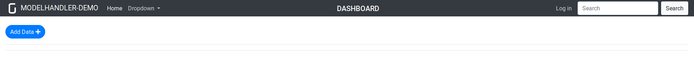

Installation
============

In order to install gramex and other material required for the workshop, please follow the following instructions.


Prerequisites
-------------

1. Install Anaconda / Miniconda
(Note for OSX: Please make sure that XCode command line tools are installed. See instructions [here](https://www.embarcadero.com/starthere/xe5/mobdevsetup/ios/en/installing_the_commandline_tools.html))
2. With the conda package manager, install the following modules:

```bash
$ conda install pandas matplotlib scikit-learn tzlocal colorama h5py
```

Installing Node / Yarn libraries
--------------------------------

1. On Linux

Ubuntu users can install nodejs and npm using the following commands:

```bash
[sudo] apt install nodejs npm
[sudo] npm install -g yarn
```

For other Linux distributions, please replace `apt` with the package manager of your distribution, e.g.  `yum` for Fedora and `pacman` for Arch Linux

2. On Windows

Windows users can download and install Node.js and npm from [here](https://nodejs.org/en/download/). After installing, please run the following command in a command prompt:

```cmd
npm install -g yarn
```

3. MacOS

OSX users can install Node.js and npm with Homebrew as follows:

```bash
$ brew install node
$ npm install -g yarn
```

Please note that if there are permission erroors, OSX / Linux users may have to run commands with `sudo`, and Windows users may have to run their command prompts as administrators.


Installing Gramex
-----------------

After the above steps are successfully executed, install gramex as follows:

```bash
$ pip install git+https://github.com/gramener/gramex@jd-grx-core#egg=gramex
$ gramex setup ui
```

Alternative installation
-------------------------

Gramex can be installed as a Docker instance.

```bash
docker pull gramener/gramex     # or docker pull gramener/gramex:1.27.0

# Run Gramex on port 9988
docker run --name gramex-instance -p 9988:9988 gramener/gramex

# Run bash inside the container
docker run --name gramex-instance -i -t -p 9988:9988 gramener/gramex /bin/bash

# To re-connect to the instance:
docker start -i -a gramex-instance

# Other useful commands
docker container ls           # list instances
docker rm gramex-instance     # delete instance
```

Download Workshop Material
--------------------------

Download the workshop material from [here](https://github.com/gramexrecipes/gramex-ml-workshop/archive/master.zip) and extract the archive in any convenient location. This location will henceforth be referred to as _project folder_.

Navigate to the project folder through the terminal or the command prompt, and run Gramex as follows:

```bash
$ gramex
```

When gramex starts running, you should be able to see some output logs. When you see the following lines,

```
INFO    22-Apr 13:34:26 __init__ PORT Listening on port 9988
INFO    22-Apr 13:34:26 __init__ 9988 <Ctrl-B> opens the browser. <Ctrl-D> starts the debugger.
```

the gramex server is ready to serve the application.

Please visit [`http://localhost:9988`](http://localhost:9988) in your browser. If you see a web page which lookks something  like the following screenshot, you are ready for the workshop.



In case of any problems or questions, send an email to jaidev.deshpande@gramener.com
