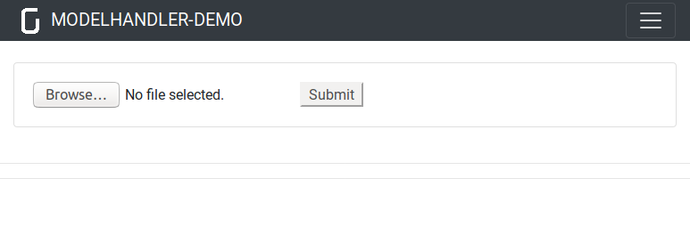
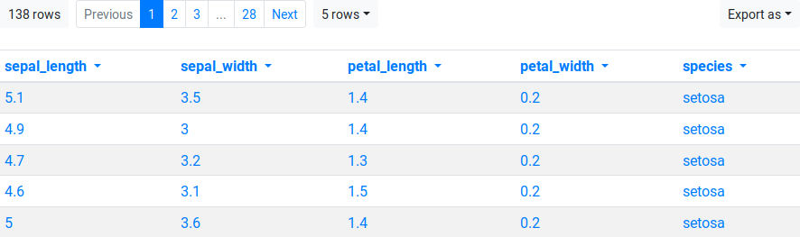
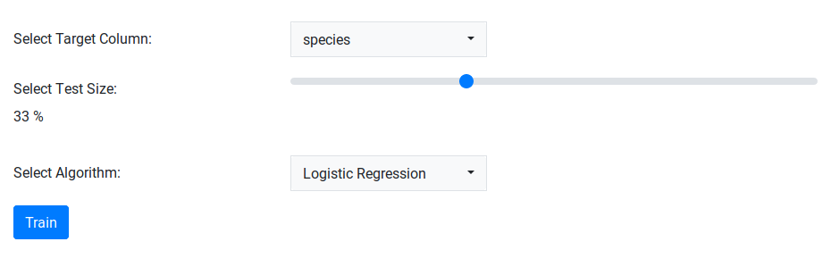
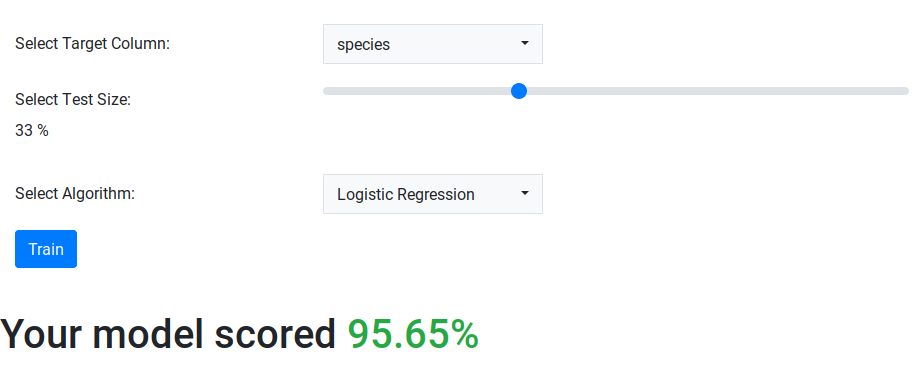

Setting up & Using the Gramex ML Demo Application
=================================================

This document assumes that you have finished the installation instructions provided in the [installation guide](install.md). If gramex and all its dependencies are install, launch the app by running

## Starting the application

To start a `gramex` application, run `gramex` in a terminal or command prompt (or similar):

```bash
$ gramex
```

This will run the application in the default port of `9988`.

in the project folder. Visit [http://localhost:9988](http://localhost:9988) in your browser.
You should now see a web page which looks similar to the following:




## Uploading data

You may use the following sample datasets included with this application.
Download any of these files and upload them to the application by clicking the "Browse" button.

1. [Fisher's iris dataset](datasets/iris.csv) - Predict the species of Iris flower samples based on measurements of petals and sepals.

2. [UCI Breast Cancer Diagnostic dataset](datasets/breast_cancer.csv) - Predict whether a tumor is malignant, based on measurements of cells in autopsied breast masses.

3. [UCI Wine dataset](datasets/wine.csv) - Predict type of wine based on chemical analysis properties of wine samples.


Additionally, any dataset can be uploaded in CSV format, subject to the following requirements:

1. the dataset should represent a _classification_ problem,
i.e. one column in the dataset should be a _categorical variable_, which denotes the class of the row.
It should not be a continuous / floating point value.
This column is called the `"target column"` or simply `"target"`.
(E.g. the targets for the Iris, Breast Cancer and Wine datasets are `species`, `class` and `is_malignant`, respectively.)

2. no preprocessing should be required on the data - the data should be present in a format that is consumable by the models. No encoding or preprocessing of variables is supported.

Once the dataset is uploaded, you should see the dataset on the web app, and some controls below it, as follows:




## Training & Testing ML Algorithms

The core function of this application is to train a classification model on a part of the dataset,
and to test its performance on the other part. To do this, the application has a control panel
which looks like this:



You can test differnt classification algorithms on your dataset as follows:

1. Pick a target column in the "Select Target Column" section. By default,
the last (or the rightmost) column in the dataset is selected as the target column.

2. Choose a test size by dragging the slider in the "Select Test Size" section. The test size denotes the fraction of the data size that is set aside for testing, and the model is trained on the remainder of the dataset. The default test size is 33%.

3. Select an algorithm using the dropdown in the "Select Algorithm" section. These algorithms are implemented in [scikit-learn](https://scikit-learn.org). For details of these algorithms, please visit the scikit-learn guide on [supervised learning](https://scikit-learn.org/stable/supervised_learning.html).

4. Click "Train", and the accuracy of the model on the test dataset should show up on the page, as follows:


