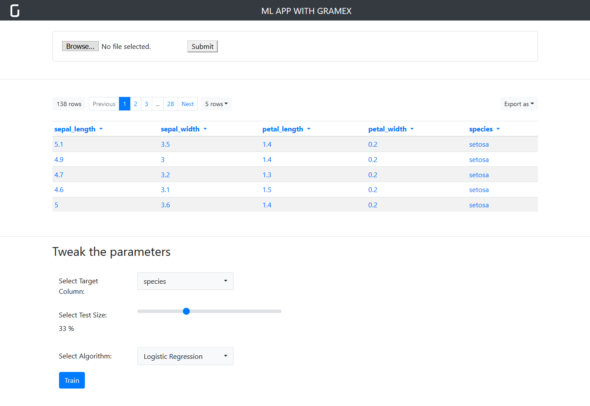

# Building ML applications with Gramex

## Objective

We'll build a ML Classification application with Gramex.

## Outline

The workshop begins at 11:30 am.

| Section | Content | Duration |
| ------- | ------- | -------- |
| [Introduction](#introduction) | Gramex intro, controlling data with URL params | 20 mins, 11:30 to 11:50 am |
| [Build an ML app](#snippets) | Use [snippets](snippets/) and build the application step-by-step | 50 mins, 11:50 to 12:40 pm |
| Q&A, Support | Q&A session, help the participants | 10 mins, 12:40 to 12:50 pm |
| [Possibilities](#possibilities) | Other ML applications, Email alerts, Charts, Screenshots, Admin module | 10 mins, 12:50 to 1 pm |

## Assumptions

- you've [installed](install.md) Gramex correctly. If you've noticed any errors please share now.
- you're familiar with ML and would like to build web apps easily.

## What we will do today

- construct a simple app with building blocks (`HTML`, `JS`, `Python`, `Gramex`, little `Tornado`).
- create an app that trains, tests datasets and review the output.
- we won't be reviewing ML algorithms or scikit-learn.

This is how the application would at the end of it:



## What it needs

1) Make sure you install the [necessary software](install.md) before you arrive at the workshop.

2) Clone this [repository](https://github.com/gramexrecipes/gramex-ml-workshop/), stick with `master` branch.

3) Use [Visual Studio Code](https://code.visualstudio.com/), add the cloned directory as a workspace.

4) Optionally, you can add our VSCode extension [Gramex Snippets](https://marketplace.visualstudio.com/items?itemName=gramener.gramexsnippets). Include the below lines in `settings.json` in VSCode for suggestions to work.

```json
{
  "editor.tabCompletion": "on",
  "editor.quickSuggestions": {
    "other": true,
    "comments": false,
    "strings": true
  }
}
```

# Introduction

[Gramex](https://gramener.com/gramex/guide/) is a FOSS web and data server. One can do the below with minimal setup

- fetch, edit, delete data records
- execute arbitrary python
- auth support: database-based, active directory-based, google, social (twitter, facebook)
- capture screenshots
- configure smart email alerts and a lot more...

most of it via `YAML` configuration.

## URLs

Consider a dataset that you'd like to explore for exploratory data analysis, we'll use the model `iris` [dataset](https://gist.github.com/curran/a08a1080b88344b0c8a7#file-readme-md).

Before that you'd like to see the composition of the file. You can explore it using `FormHandler`:

```YAML
url:
  data-endpoint:
    pattern: /$YAMLURL/iris
    handler: FormHandler
    kwargs:
      url: $YAMLPATH/datasets/iris.csv
```

Most handlers support `kwargs` section to control data from server-side.

### Notes

- We've limited the number of rows to `5` irrespective of how many rows end user requests.
- `$YAMLPATH` and `$YAMLURL` are Gramex predefined variables. Read more in the [documentation](https://gramener.com/gramex/guide/config/#predefined-variables).

```
formats: JSON, CSV, HTML
```

### URL sections
Multiple URL sections can be defined for different endpoints.

### Arbitrary python
Arbitrary `python` code can be run using `FunctionHandler`.

```YAML
url:
  custom-python-code:
    pattern: /$YAMLURL/code
    handler: FunctionHandler
    kwargs:
      function: app.my_func
```

1. Access URL parameters via attributes

2. Return values


### Other Handlers, services

Gramex is built on top of `tornado` which uses `RequestHandler` for everything and we've sub-classed to different utilities for ease of use.

- `FileHandler`
- `CaptureHandler`
- `Scheduler`
- read more at https://gramener.com/gramex/guide/

# Snippets

Head to [snippets](snippets/) directory to begin the application building.

# Possibilities

- Visit [Cluster](https://gramener.com/cluster) to explore all clustering algorithms in `scikit-learn`.
- Visit our [AI Labs](https://gramener.com/ailabs/)
- Check Speech AI sample application built on Gramex https://ai.gramener.com/speechai/
- Gramex documentation - https://gramener.com/gramex/guide/

# Contact

- Bhanu K - [Email](bhanu.kamapantula@gramener.com)
- Jaidev D - [Email](jaidev.deshpande@gramener.com)
