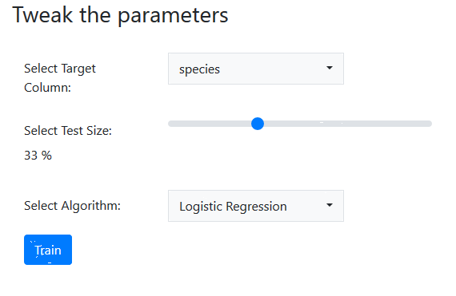

# Machine Learning with Gramex

In this tutorial, we will be building an app which exposes classifiers through a
web application, with Gramex. By the end of this tutorial, we will have covered:

1. How to expose data as a REST API through
   [formhandler](https://gramener.com/gramex/guide/formhandler/)
2. How to train scikit-learn classifiers on uploaded datasets through
   [functionhandler](https://gramener.com/gramex/guide/functionhandler/)
3. How to visualize certain elements of the trained model through JS and Vega

By the end, the app should look something like:


You can also play with a live version of the app [here](https://9018.gramex.gramener.co).

## Initialization

To get started, you will need to have [installed Gramex](install.md). Then,
clone this repository, navigate to it from your terminal, and run the
following command:

```bash
$ gramex
```

Gramex should start in a few seconds, and when you see the following lines:
```
INFO    22-Apr 13:34:26 __init__ PORT Listening on port 9988
INFO    22-Apr 13:34:26 __init__ 9988 <Ctrl-B> opens the browser. <Ctrl-D> starts the debugger.
```
visit [`http://localhost:9988`](http://localhost:9988) in your browser.


## FormHandler: Exposing Data Through a REST API

Consider a dataset that you'd like for training a classifier. In this case, we'll use the model [`iris`](https://raw.githubusercontent.com/gramexrecipes/gramex-ml-workshop/jd-newsletter/datasets/iris.csv) dataset.

We can download this dataset into the "datasets" folder within our project directory, and allow Gramex to
read it, by creating a
[`FormHandler`](https://gramener.com/gramex/guide/formhandler/). This can be done
by adding the following lines of code, in your `gramex.yaml`:

```yaml
url:
  data-endpoint:
    pattern: /$YAMLURL/data
    handler: FormHandler
    kwargs:
      # Path to the file, relative to gramex.yaml
      url: $YAMLPATH/datasets/iris.csv
```
Now you can visit [`http://localhost:9988/data`](http://localhost:9988/data) to see the data as a JSON
payload.

To expose this dataset in the home page of your application as an interactive
table, add the following lines to `index.html`:

```html
<div class="formhandler" data-src="data"></div>
<script>
  $('.formhandler').formhandler()
</script>
```

## Build your application

### Step 1 - base.html

We will begin with a pre-written HTML file, called [`snippets/base.html`](snippets/base.html).
In it, we have a navbar (header for the page).

The corresponding `YAML` routing (found in [`gramex.yaml`](snippets/gramex.yaml)) is as below:

```yaml
  workshop/snippets/base:
    pattern: /$YAMLURL/snippets/base
    handler: FileHandler
    kwargs:
      path: $YAMLPATH/snippets/base.html
      template: true
```

Your page should now look like below


### Step 2 - upload.html

In `base.html`, add the content from another file, [`snippets/upload.html`](snippets/upload.html). The latter file contains the code required to add a [`FileHandler`](https://gramener.com/gramex/guide/filehandler/), a component that is used to render HTML files.

The corresponding `YAML` routing (found in [`gramex.yaml`](snippets/gramex.yaml)) is as below:

```yaml
  workshop/snippets/upload:
    pattern: /$YAMLURL/snippets/upload_file
    handler: FileHandler
    kwargs:
      path: $YAMLPATH/snippets/upload.html
      template: true
```

Your page should now look like below


### Step 3 - table.html

We rely on a table renderer from [`g1`](https://gramener.com/gramex/guide/g1/) - a JS library used for interacttions.

For it to work, we need to integrate few lines of JS.

```html
<script src="../ui/jquery/dist/jquery.min.js"></script>
<script src="../ui/bootstrap/dist/js/bootstrap.bundle.min.js"></script>
<script src="../ui/lodash/lodash.min.js"></script>
<script src="../ui/g1/dist/g1.min.js"></script>
<script>
  // '.formhandler' is the div element in `table.html`
  $('.formhandler').formhandler({
    pageSize: 5
  })
</script>
```

The corresponding `YAML` routing (found in [`gramex.yaml`](snippets/gramex.yaml)) is as below:

```yaml
  workshop/snippets/table:
    pattern: /$YAMLURL/snippets/table
    handler: FileHandler
    kwargs:
      path: $YAMLPATH/snippets/table.html
      template: true
```

also note that rendering the table relies on `data` endpoint in [`gramex.yaml`](snippets/gramex.yaml):

```yaml
  formhandler:
    pattern: /$YAMLURL/snippets/data
    handler: FormHandler
    kwargs:
      url: $YAMLPATH/upload_data/data.csv
```

Your page should now look like below


To know more about g1's formhandler table, visit [the g1 guide](https://gramener.com/gramex/guide/g1/formhandler).

### Step 4 - training.html

Your page should now look like below


## Interactions

Let's now discuss how the application will function interactively (on user input). User can:

- [upload a file](#file-upload)
  - upon which table is updated
  - `Tweak the parameters` section is updated
  - and model can be trained
- [Train the model](#train-the-model)

### File upload

Gramex handles any file uploads via `UploadHandler` with several out-of-the-box features (overwriting, replacement, redirection etc.).

```yaml
  uploadhandler:
    pattern: /$YAMLURL/snippets/upload_file
    handler: UploadHandler
    kwargs:
      if_exists: overwrite            # Overwrite the original without backup
      path: $YAMLPATH/upload_data
  # this will show the output post file uploading
```

### Train the model

Note the attributes that change he selections in `Tweak the parameters` section.

| Type | Values | Notes |
| ---- | ------ | ----- |
| Select target columns | List of features from data | Categorical variables will be used for the workshop. |
| Select test size      | Dataset % as test size, 0 to 100% | Change it to see how model accuracy varies! |
| Select algorithm | List of features from data, algorithm to train with |Note that model accuracy is applicable to linear models alone, for the rest it's not implemented for this workshop. |

#### Target selection
To populate the values in `Select Algorithm` select option, refer to the variable `model_list` in `js/script.js`.

#### Algorithm selection
To populate the values in `Select Algorithm` select option, refer to the variable `model_list` in `js/script.js`.

```js
{
  'label': 'Logistic Regression',
  'value': 'sklearn.linear_model.LogisticRegression'
}
```
where `label` is what is shown in the `select` option while `sklearn.linear_model.LogisticRegression` is its value.

#### Training 



Clicking on `Train` button makes an `AJAX` request. If you aren't familiar with it, that's fine. It's a mechanism to retrieve information from server asynchronously.

```js
function train() {
  $.ajax({
    url: 'train_method',    // train_method is a route in gramex.yaml
    type: 'post',           // makes a POST request
    data: {
      'model': modelName,
      'url': 'upload_data/data.csv',
      'targetCol': targetCol,
      'testSize': testSize,
    },
    success: (response_data) => {
      // response is rendered in `report.html` that has div#report element
      $('#report').html(response_data)
    }
  })
}
```

observe the `train_method` route defined in `url` attribute in `$.ajax` above defined in the YAML configuration below...

that's how requests are routed from front-end to back-end.

```yaml
# snippet for `train_method` endpoint in gramex.yaml
modelhandler:
  pattern: /$YAMLURL/train_method
  handler: FunctionHandler
  kwargs:
    # runs train_method() function in modelhandler_demo.py
    function: modelhandler_demo.train_method
```

The key aspects of the back-end (`python`) are:

- URL parameter retrieval

```py
url = handler.get_argument('url')
clf = locate(handler.get_argument('model'))()
test_size = float(handler.get_argument('testSize')) / 100
target_col = handler.get_argument('targetCol')
```

- training/test data split, fit to classifier and determine accuracy

```py
# train/test data split, fit to classifier and determine accuracy
xtrain, xtest, ytrain, ytest = train_test_split(
        x, y, test_size=test_size, shuffle=True, stratify=y)
clf.fit(xtrain, ytrain)
score = clf.score(xtest, ytest)
```

- send the output to front-end (`JavaScript`)

```py
with open(op.join(YAMLPATH, 'report.html'), 'r', encoding='utf8') as fout:
    tmpl = Template(fout.read())
viz = _make_chart(clf, dfx)
return tmpl.generate(score=score, model=clf, spec=viz)
```

## Final output

Your page should now look like below


If it doesn't, don't worry. Look at the content in [`snippets/curated.html`](snippets/curated.html) and replicate it or copy/paste it.
