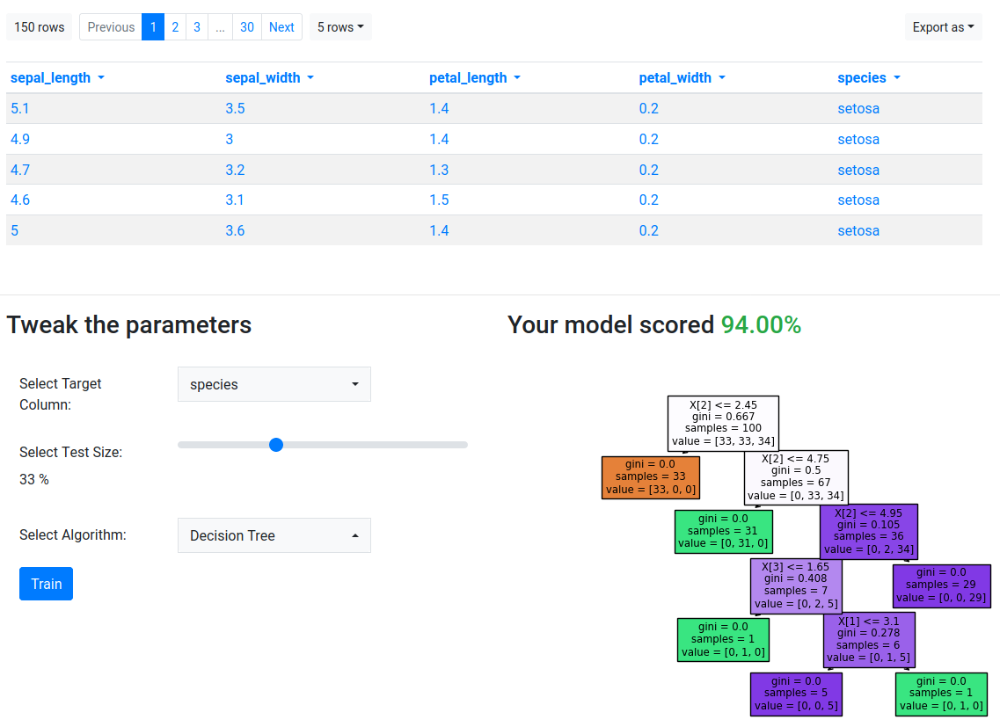

# Machine Learning with Gramex

In this tutorial, we will be building an app which exposes classifiers through a
web application, with Gramex. By the end of this tutorial, we will have covered:

1. How to expose data as a REST API through
   [formhandler](https://gramener.com/gramex/guide/formhandler)
2. How to train scikit-learn classifiers on uploaded datasets through
   [functionhandler](https://gramener.com/gramex/guide/functionhandler)
3. How to visualize certain elements of the trained model through JS and Vega

By the end, the app should look something like:


You can also play with a live version of the app [here](https://9018.gramex.gramener.co).

## Initialization & Scaffolding

To get started, you will need to have [installed Gramex](install.md). Then,
clone this repository, navigate to it from your terminal, and run the
following command:

```bash
$ gramex
```

Gramex should start in a few seconds, and when you see the following lines:
```
INFO    22-Apr 13:34:26 __init__ PORT Listening on port 9988
INFO    22-Apr 13:34:26 __init__ 9988 <Ctrl-B> opens the browser. <Ctrl-D> starts the debugger.
```
visit [`http://localhost:9988`](http://localhost:9988) in your browser.


## FormHandler: Exposing Data Through a REST API

Consider a dataset that you'd like for training a classifier. In this case, we'll use the model [`iris`](https://raw.githubusercontent.com/gramexrecipes/gramex-ml-workshop/jd-newsletter/datasets/iris.csv) dataset.

We can download this dataset into our project directory, and allow Gramex to
read it, by creating a
[`FormHandler`](https://gramener.com/gramex/guide/formhandler). This can be done
by adding the following lines of code, in your `gramex.yaml`:

```yaml
url:
  data-endpoint:
    pattern: /$YAMLURL/iris
    handler: FormHandler
    kwargs:
      # Path to the file, relative to gramex.yaml
      url: $YAMLPATH/iris.csv
```
Now you can visit [`http://localhost:9988/iris`] to see the data as a JSON
payload.

